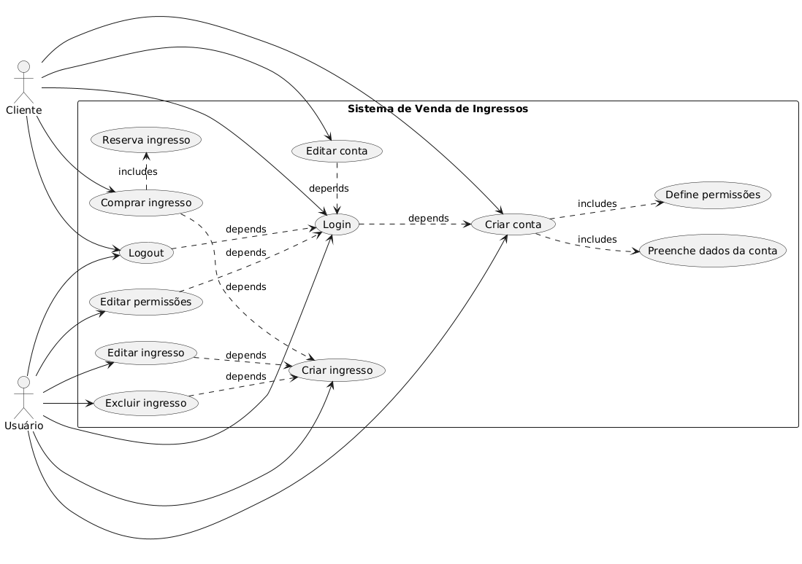

# Projeto Final Dev Evolution

## Instruções para rodar o projeto/sistema
1. Inicar o server com "php -S localhost:8000"
2. Acessar "http://127.0.0.1:8000/public/login.html"
3. Criar uma conta caso não tenha clicando em "Criar conta"
4. Logar com a conta criada

### Como usuário:
1. Ao criar um usuário você deve definir o nome, email e senha e suas permissões de edição e exclusão de ingressos
2. Após logar como usuário é possível editar suas permissões em "Editar permissões" ou realizar o logout clicando em "Sair"
3. Para criar ingressos preencha o form de ingressos e clique em "Adicionar ingresso"
4. Com ingressos criados serão apresentados os ingressos deste vendedor na tela
5. O usuário pode editar informações no ingresso clicando em "Editar" ou excluir ingressos clicando em "Excluir"

### Como cliente:
1. Ao criar um cliente você deve definir nome, email e senha
2. Após logar como cliente é possível editar sua conta, alterar a senha e excluir a conta clicando em "Editar conta" ou realizar o logout clicando em "Sair"
3. O cliente pode comprar o ingresso desejado da lista de ingresos clicando em comprar ingresso
4. Caso o ingresso esteja disponível irá para a tela de confirmar compra, onde caso o ingresso seja o último ele será reservado por 2 minutos, assim outros clientes não poderão comprar durante esse intervalo de tempo
5. Caso o cliente confirme a compra a quantidade do ingresso é decrementada em 1

## Diagrama simples do funcionamento

## Explicação do funcionamento
- Criação de conta
    1. No register.html preenche os dados da conta que deseja criar (usuário ou cliente) e envia o form
    2. Caso crie um usuário:
        - Chama o register-user.php que primeiramente valida o method enviado, caso não seja "post" envia de volta para register.html
        - Cria um array para armazenar os erros encontrados na validações
        - Usa filter_var para salvar o nome e e-mail de usuário
        - Valida se já não existe um usuário com este e-mail
        - Valida se a senha tem o tamanho mínimo de 8 caracteres 
        - Cria o hash da senha
        - Salva em formato booleano as permissões de edição e exclusão de ingressos
        - Caso não tenha erros cria o usuário chamando o método create da classe User
        - Caso tenha erros redireciona para register.html apresentando os erros na URL
    3. Caso crie um cliente:
        - Chama o register-client.php que primeiramente valida o method enviado, caso não seja "post" envia de volta para register.html
        - Cria um array para armazenar os erros encontrados na validações
        - Usa filter_var para salvar o nome e e-mail do cliente
        - Valida se já não existe um cliente com este e-mail
        - Valida se a senha tem o tamanho mínimo de 8 caracteres 
        - Cria o hash da senha
        - Caso não tenha erros cria o cliente chamando o método create da classe Client
        - Caso tenha erros redireciona para register.html apresentando os erros na URL
- Login
    1. No login.html o usuário preenche os dados de login, seja de cliente ou de usuário 
    2. Ao enviar o form será chamado o arquivo login-user.php em caso de login de usuário e login-client.php em caso de cliente
    3. No arquivo php de login será usada a função find da classe User ou Client para verificar se o e-mail informado existe cadastrado, caso tenha retorna para login.html e informa o erro na URL
    4. Caso o e-mail esteja disponível irá usar a função password_verify para validar se a senha informada é a mesma salva no banco deste usuário
    5. Caso a senha esteja correta irá criar as variáveis de sessão id e e-mail usando a superglobal $_SESSION e envia para o client.php ou user.php
    6. Caso a senha esteja errada retorna para a tela de login.html informando o erro na URL
- Tela de cliente
    1. O cliente pode editar as informações de sua conta, alterar a sua senha ou excluir sua conta ao clicar em "Editar conta" que irá chamar com method get o arquivo edit-account.php
        - O cliente pode editar o nome ou e-mail da sua conta que será enviado como post para o mesmo arquivo, realizando as validações das informações com filter_var e posteriormente realizando o update em caso de ausência de erros
        - O cliente pode alterar sua senha informando a senha atual e duas vezes, para confirmação, a nova senha. A requisição post será enviada para o mesmo arquivo onde fará a validação de ambas as senhas, criação da hash da nova senha e salvando com o método update da classe
        - Por fim o usuário pode excluir sua conta, onde deve informar sua senha para confirmar e caso esteja correta envia a requisição post para o mesmo arquivo onde será usado o método delete da classe para excluir a conta
        - Após qualquer alteração na conta o usuário é automaticamente deslogado precisando criar uma nova conta em caso de exclusão da antiga ou logar com os novos dados em caso de edição
    2. Clicando no botão "Sair" chama o arquivo logout.php que limpa e destrói os dados de sessão e envia para a tela de login
    3. O cliente pode comprar ingressos clicando em "Comprar" no ingresso desejado, caso o ingresso esteja disponível, ou seja, não está esgotado e nem reservado abrirá o form criado pelo arquivo buy-ticket.php.
        - Caso seja o último ingresso o sistema altera 3 campos no banco de dados, são eles "reservado", "cliente_reservado" e "data_ultima_reserva"
        - O campo reservado indica rapidamente se o ingresso está ou não reservado
        - O campo cleinte_reservado mostra o cliente que reservou o ingresso
        - O campo data_ultima_reserva indica quando foi feita a reserva 
        - Caso a reserva passe de 2 minutos e o usuário não confirme a compra, os campos são resetados e o ingresso fica disponível novamente. A validação de 2 minutos é feita pela função validarUltimaReserva do arquivo buy-ticket.php
        - Caso o usuário confirme a compra a quantidade do ingresso é decrementada em 1 e é criado um registro de compra no banco de dados
- Tela de usuário
    1. O usuário pode editar suas permissões clicando em "Editar permissões" onde pode definir se pode ou não editar e deletar ingressos, alteração é feita pelo edit-permission.php
    2. Clicando no botão "Sair" chama o arquivo logout.php que limpa e destrói os dados de sessão e envia para a tela de login
    3. O usuário pode cadastrar ingressos preenchendo as informações obrigatórias nome do evento, valor do ingresso, data do evento e quantidade, o campo descrição é opcional
        - Ao clicar em "Adicionar ingresso" chama o arquivo create-ticket.php que fará as validações dos campos com filter_var para salvar corretamente no banco de dados usando o método create da classe
    4. O usuário pode visualizar todos os ingressos que ele criou e realizar a ação de edição ou exclusão
        - Ao clicar em excluir é chamado o arquivo delete-ticket que verificará se o usuário tem permissão antes de deletar, caso o usuário tenha permissão a exclusão é feita pelo método delete da classe
        - Ao clicar em editar chama o arquivo edit-ticket.php que abre um form com os campos do ingresso que se pode editar, os mesmos da criação de ingresso, o usuário irá preencher as novas informações e clicar em salvar alterações o edit-ticket.php usa o método update da classe para alterar os dados dos ingressos

## Checklist do que foi implementado
### Usuários

- [X]  Criar (cadastro via formulário HTML)
- [X]  Editar e deletar (somente próprios dados)
- [X]  Ver (lista restrita)

### Ingressos

- [X]  Criar, editar, deletar, visualizar
- [X]  Reserva de estoque em tempo real (com `data_reserva`)
- [X]  Bloqueio por 2 minutos ao acessar o último item

### Clientes

- [X]  Criar, editar, deletar (restrito por usuário)
- [X]  Visualização restrita por usuário (não veem outros clientes)

### Compras

- [X]  Comprar produto, com controle de estoque
- [X]  Cancelar reserva após timeout (2 minutos)
- [X]  Exibir mensagem de "Produto indisponível" se esgotado

### Segurança
- [X]  Todos os dados enviados via formulário devem ser **validados e limpos** (`htmlspecialchars`, `filter_var` etc.).
- [X]  Autenticação feita pelo session do PHP deve ser verificada em **todas as páginas protegidas**.
- [X]  Ações sensíveis (deletar, editar) devem verificar se o usuário **tem permissão**.